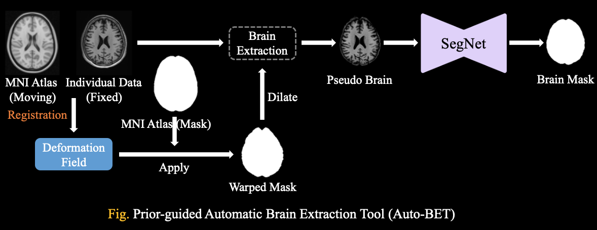
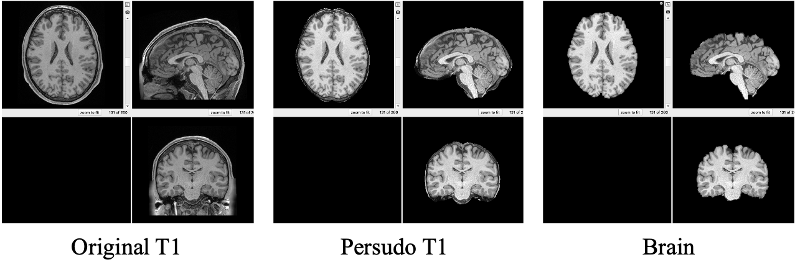

# Automatic Brain Extraction Tools (Auto-BET)
Repo for Prior-guided Automatic Brain Extraction Tool (Auto-BET)
## [<font color=#F8B48F size=3>License</font> ](./LICENSE)
```
Copyright IDEA Lab, School of Biomedical Engineering, ShanghaiTech. Shanghai, China

Licensed under the the GPL (General Public License);
you may not use this file except in compliance with the License.
You may obtain a copy of the License at

    http://www.apache.org/licenses/LICENSE-2.0

Repo for Adult Brain Extraction Tools (ABT)
Contact: JiamengLiu.PRC@gmail.com
```

## Framework


**Step 1**: ACPC correction 
* ACPC correction for original data set (ref to MNI atlas)
    ```shell
    python ./code/ACPC_Correction.py --input /path/to/original/T1w/Image --output /path/to/save/path --RefImg /path/to/MNI/Atlas/with/Skull
    ```

**Step 2**: Persudo Brain Extraction
* Due to the dramatic variation among scanners and scan parameters, we first using image registration methods (unsupervise) to eliminate the redundant tissues, such as, neck, face et al.
    ```shell
    python ./code/ACPC_Correction.py --input /path/to/ACPC/Corrected/T1w/Image --output /path/to/persudo/brain/path --RefImg /path/to/MNI/Atlas/with/Skull --RefSeg /path/to/MNI/brain/mask
    ```

**Step 3** Brain Extraction (Standard)
* For people without large GPU memory
    ```shell
    python ./code/AutoBET-Standard.py --model_path /path/to/pretrained/Standard/AutoBET/Model --input /path/to/persudo/brain/image --output_brain /path/to/save/brain --output_brain_mask /path/to/save/brain_mask
    ```

**Step 4** Brain Extraction (Fine)
* For people with large GPU memory
    ```shell
    python ./code/AutoBET-Fine.py --model_path /path/to/pretrained/Fine/AutoBET/Model --input /path/to/persudo/brain/image --output_brain /path/to/save/brain --output_brain_mask /path/to/save/brain_mask
    ```

***



## Installation


Clone this repo
```shell
git clone https://github.com/SaberPRC/Auto-BET.git
```
This code requires Pytorch 1.11.0 and Python 3.8.13, please install dependencies by
```shell
pip install -r requirements.txt
```

## Pretrained model

* [Auto-BET Fine](https://drive.google.com/file/d/1lQcN8wl1kOrPB6UTHC0XbcKSMDuQ4jdV/view?usp=sharing)

* [Auto-BET Standard](https://drive.google.com/file/d/14BYj93xmW7AmdERZ2rRIXkHU_mRqrzqB/view?usp=sharing)


